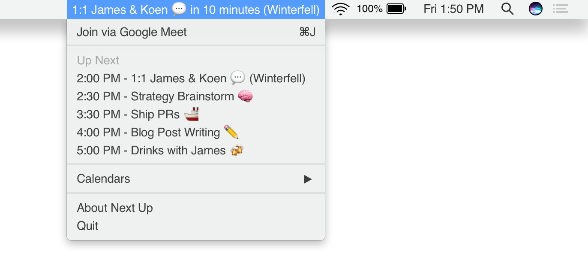

# Next Up

A quick overview of your meetings for the day. [Download](Next Up.zip)

## Huge Disclaimer! ⚠️
All credit for the idea behind this app goes to [Ellen Li](https://ellen.li). In almost all ways this is a direct copy of her [Up Next app](https://ellen.li/up-next/). I created this copy because I'm a long time user of her app and wanted to make some tweaks for my specific use-case. Making the tweaks also allowed me to advance my knowledge of Swift.

So what did I change?
- Added multi-calendar support
- Added "Open at login" option (_coming soon_)
- Left out the "Present via Google Meet" option
